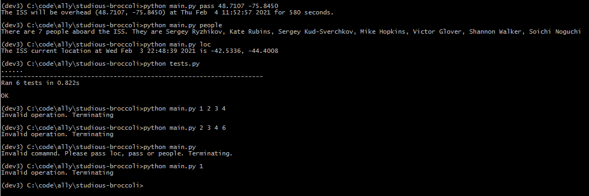

# About

There is an API (http://api.open-notify.org/) that provides information on the International Space Station. Documentation is provided via the website, along with sample request/response. This repository is a quick demonstration of http requests, unit tests, command line arguments, etc.

